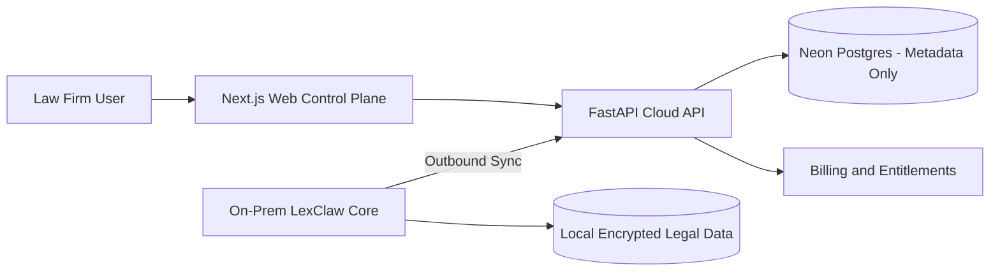

# LexClaw System Context

```mermaid
graph LR
  U[Law Firm User] --> W[Next.js Web Control Plane]
  W --> A[FastAPI Cloud API]
  A --> D[(Neon Postgres - Metadata Only)]
  N[On-Prem LexClaw Core] -->|Outbound Sync| A
  N --> L[(Local Encrypted Legal Data)]
  A --> S[Billing and Entitlements]
```

Cloud components store metadata only; legal content remains in on-prem local storage.
